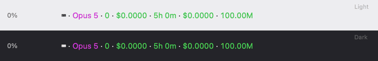
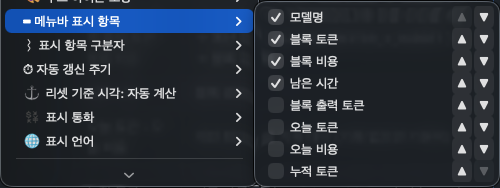
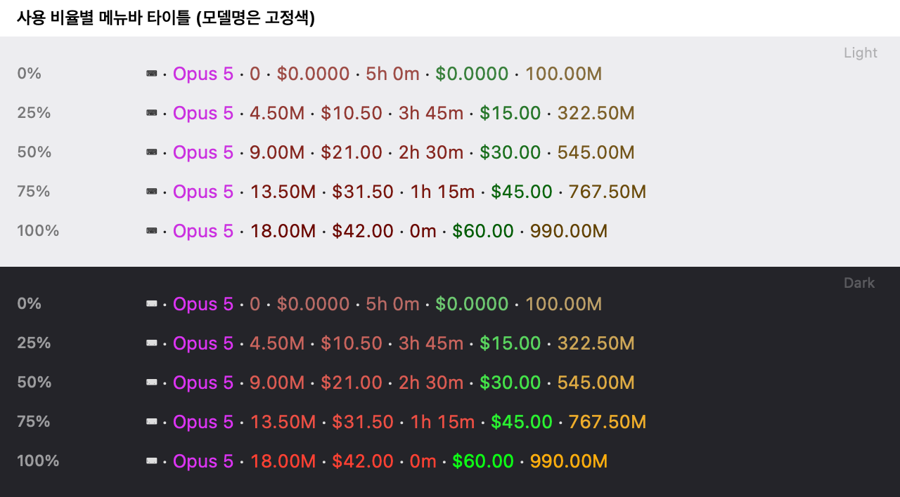
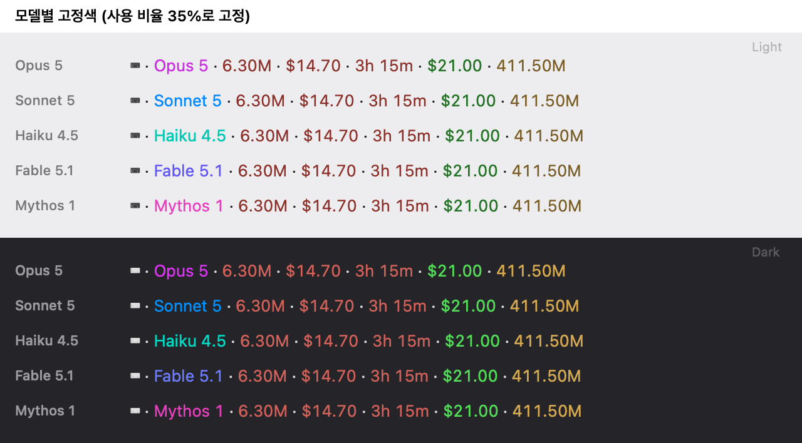

# Claude Code Usage Monitor

macOS 메뉴바에서 Claude Code 5시간 블록 사용량을 실시간으로 확인하는 네이티브 Swift 앱.

> **⚠️ 비공식 프로젝트** — 커뮤니티가 만든 유틸리티이며 **Anthropic PBC와 무관**합니다(제작·후원·보증 관계 없음).
> "Claude"·"Claude Code"는 Anthropic PBC의 상표이며, 이 앱이 읽는 로컬 사용량 데이터를 식별하기 위해 **설명 목적으로만** 사용합니다.

<p align="center">
  <br>
  <sub>사용 비율에 따라 바뀌는 메뉴바 색 — 앱 코드로 렌더링한 예시(값은 가상)</sub>
</p>

## 간편 설치

### Homebrew (권장)

```bash
brew install ahngbeom/tap/cc-menutor
brew services start cc-menutor      # 지금 시작 + 로그인 시 자동 시작
```

### 설치 스크립트 (Homebrew 미사용 시)

```bash
curl -fsSL https://raw.githubusercontent.com/Ahngbeom/cc-menutor/main/scripts/install.sh | bash
```

최신 릴리스가 자동으로 선택됩니다. 특정 버전을 원하면 `CC_MENUTOR_VERSION`을 지정하세요:

```bash
curl -fsSL https://raw.githubusercontent.com/Ahngbeom/cc-menutor/main/scripts/install.sh | CC_MENUTOR_VERSION=1.13 bash
```

제거: `curl -fsSL https://raw.githubusercontent.com/Ahngbeom/cc-menutor/main/scripts/uninstall.sh | bash`
(사용자 설정까지 지우려면 끝에 `-s -- --purge`를 붙입니다.)

> 두 방식 모두 **사용자 기계에서 소스를 직접 빌드**합니다(Xcode Command Line Tools 필요). 미리 빌드된
> 바이너리를 받지 않으므로 코드서명·Gatekeeper 이슈가 없습니다.

## 기능

- **5시간 블록** — Claude Code가 산출한 활성 블록의 진행률·리셋까지 남은 시간·소모율(burn rate)
- **모델별 breakdown** — Opus / Sonnet / Haiku 각각의 토큰 및 비용 (버전 자동 인식)
- **오늘 통계** — 당일(로컬 기준) 토큰·비용·모델별 분해
- **주간·월별 통계** — 이번 주/이번 달 합계에 일평균·직전 기간 대비 참고치, 월말 예상 비용까지([아래](#주간월별-통계) 참고)
- **한도 소진 추이** — 서버 실측 사용률을 주 단위로 적립해 플랜 업/다운그레이드 판단 근거를 제공([아래](#한도-소진-추이) 참고)
- **전체 누적** — 기록된 전체 사용량
- **30초 자동 갱신** — 백그라운드 처리, 파일 변경 시에만 재읽기
- **메뉴바 동적 색상** — 항목 계열별(한계·오늘·누적) 색상 안에서 사용 비율만큼 색이 짙어짐, 모델명은 모델별 고정색([아래](#메뉴바-동적-색상) 참고)
- **메뉴바 커스터마이징** — 표시 항목·순서·구분자·아이콘·자동 갱신 주기·표시 통화를 메뉴에서 바로 변경(재빌드 불필요, [커스터마이징](#커스터마이징) 참고)
- **원화 환산** — 표시 통화를 「원화」로 바꾸면 실시간 환율로 환산한 금액을 표시([표시 통화](#표시-통화-원화-환산) 참고)
- **재미 모드(옵트인, 기본 전부 꺼짐)** — 무드 아이콘 / 연속 사용 기록 / 마일스톤 축하, [아래](#재미-모드) 참고

메뉴바 타이틀은 기본적으로 `모델명 · 블록 토큰 · 블록 비용 · 남은 시간`을 보여 주며(항목·순서 변경 가능),
최근 5시간 내 활동이 없으면 `⌨ 쉬는 중`으로 표시됩니다.

## 한도 소진 추이

구독 플랜(Pro / Max 5x / Max 20x)을 올릴지 내릴지 판단하려면 "지금 몇 %"가 아니라 **"평소에 몇 %까지 가는가"** 를 알아야 합니다. 이 섹션은 그 분포를 보여줍니다.

```
📉  한도 소진 추이 (서버 주간 창 기준)
  주간 피크: ▁▃█·▅▂▁
  최고 78% · 평균 31% (완료 6주)
  ⚠️ 5시간 한도 90%+ 도달: 3회
```

읽는 법:

- **주간 피크**는 각 주간 창에서 관측된 **최대** 사용률입니다. 막대 높이의 스케일은 항상 0~100% 고정이라, 막대가 낮으면 실제로 한도에서 먼 것입니다.
- **`·` 는 관측이 없던 주**입니다. 앱이 꺼져 있었거나 Claude Code를 쓰지 않은 주라 막대를 그릴 수 없습니다. 이 자리를 비우지 않고 막대만 이어 붙이면 3주 공백이 인접한 주처럼 보여 그래프가 실제보다 짧은 기간을 나타내는 것처럼 읽힙니다.
- **진행 중인 주는 집계에서 빠집니다.** 아직 안 끝난 주를 완료된 주와 함께 평균 내면, 리셋 직후엔 평균이 끌려 내려가고 주중에는 계속 올라가서 사용 패턴이 그대로인데도 숫자가 요동칩니다. 현재 주의 실시간 사용률은 바로 위 `🎯 서버 실측 사용률` 섹션에 있습니다.
- **다운그레이드 신호**: 여러 주 연속으로 피크가 낮게 유지될 때
- **업그레이드 신호**: 피크가 자주 90%에 닿거나 5시간 한도 도달 횟수가 쌓일 때
- 관측이 4주 미만이면 `ⓘ 데이터 수집 중` 안내가 함께 표시됩니다. **그 전에는 판단하지 마세요** — 한 주는 휴가일 수도, 대형 리팩터링 주간일 수도 있습니다.
- 최근 12주치만 보관하며, 그보다 오래된 기록은 시각 기준으로 버려집니다.

### 왜 「서버 주간 창」이라고 따로 표시하나

위쪽 [주간/월별 통계](#주간월별-통계)의 "이번 주"는 **일요일에 시작하는 달력 주**지만, 서버의 주간 한도 창은 임의 위상(예: 금 16:00 ~ 금 16:00)입니다. **두 구간은 다릅니다.** 숫자가 서로 안 맞는 게 정상이므로 섹션과 라벨을 분리했습니다. 아래 「⚠️ Claude Code의 90% 알림과의 차이」에서 설명하는 것과 같은 종류의 구분입니다.

### 데이터 출처와 한계

이 섹션은 `~/.claude/rate-limits-cache.json`(→ [리셋 기준 시각 보정](#리셋-기준-시각-보정-) 설정 필요)의 **서버 실측 사용률**을 매 갱신 주기마다 읽어 창별 최대값으로 적립합니다. 그 파일을 한 번도 만든 적이 없으면 섹션도 나타나지 않습니다.

이미 이력이 쌓인 뒤에 그 파일을 지우거나 statusLine 연동을 끊으면, 섹션은 **마지막으로 관측한 값에 멈춘 채** 남습니다(새 데이터가 들어오지 않을 뿐입니다). 12주가 지나면 오래된 기록이 모두 만료되어 섹션이 저절로 사라집니다.

몇 가지 한계를 밝혀 둡니다.

- **이력은 앱을 설치한 시점부터 쌓입니다.** 과거를 소급할 방법은 없습니다 — 서버가 이력을 주지 않고, 그 값은 API 응답 헤더로만 전달되기 때문입니다.
- **앱이 꺼져 있던 동안의 피크는 놓칩니다.** LaunchAgent로 상시 실행하면 대부분 잡히지만, 재부팅 직후 등의 공백은 어쩔 수 없습니다.
- **절대 한도(토큰 수)나 "20x로 가면 몇 %" 같은 환산은 제공하지 않습니다.** 공식 문서에 플랜별 절대 한도가 없고, 널리 인용되는 비공식 수치조차 플랜 이름의 배수(5x·20x)와 맞지 않으며 모델별로도 다릅니다. 근거 없는 숫자로 플랜 변경을 유도하지 않기 위해 의도적으로 뺐습니다.

> 이 앱은 계정 정보를 읽지 않으므로 현재 플랜 등급을 표시하지 않습니다. 위 %는 **어차피 사용자의 플랜 기준으로 서버가 계산한 값**이라 플랜을 몰라도 판단에 지장이 없습니다.

## 주간/월별 통계

드롭다운의 「오늘」과 「전체 누적」 사이에 두 섹션이 추가됩니다.

```
📅  이번 주 (2026-08-16~)
  전체 토큰: 34.86M
  예상 비용: $30.48
  일평균: $6.10/일 (5일 경과)
  지난 주: $2,491.93
🗓  이번 달 (2026-08)
  전체 토큰: 6542.66M
  예상 비용: $4,573.63
  일평균: $228.68/일 (20일 경과)
  월말 예상: ≈$7,089.13
  지난 달: $4,009.69
```

읽는 법:

- **주의 시작은 일요일**입니다. Claude Code CLI가 주간 집계를 그렇게 나누기 때문이며, 이 앱은 CLI가
  이미 계산해 둔 값을 그대로 보여줍니다.
- **일평균**의 분모는 "기간 시작일부터 오늘까지(오늘 포함)"입니다. 아직 오지 않은 날은 세지 않으므로
  월초에도 평균이 인위적으로 낮아지지 않습니다.
- **월말 예상(`≈`)** 은 그 일평균을 그 달 전체 일수로 외삽한 값입니다. 관측치가 아니라 추정이라
  `≈`를 붙이며, 사용 패턴이 바뀌면 당연히 빗나갑니다. 달의 마지막 날에는 예상 == 실제라 줄이 사라집니다.
- **지난 주/지난 달**은 완결된 기간의 총액을 참고용으로 나란히 둔 것입니다. 증감률(%)은 일부러
  표시하지 않습니다 — 3일 지난 이번 주와 완결된 지난 주를 나눈 "-70%"는 절약한 게 아니라 아직
  지나지 않은 것뿐이라 오독을 부릅니다.
- 해당 기간에 사용이 없거나 CLI 캐시 보관 기간(주간 약 6주, 월간 약 2개월)을 벗어나면 그 줄 또는
  섹션이 통째로 사라집니다.
- 금액은 [표시 통화](#표시-통화-원화-환산) 설정을 그대로 따릅니다(원화 모드면 전부 원화).
- 이 섹션들은 [리셋 기준 시각 보정(⚓)](#리셋-기준-시각-보정-)의 영향을 받지 않습니다. 앵커는
  5시간 블록 경계를 옮기는 설정이고, 주·월 경계는 달력이 정하기 때문입니다.

> `stats-cache.json`이 없어 **추정 모드**(JSONL 폴백)로 동작할 때는 이 두 섹션의 비용도 추정 단가
> 기반이며, 오래된 프로젝트 로그가 정리된 만큼 월간 합계가 과소집계될 수 있습니다.

## 재미 모드

메뉴 하단 "🎭 재미 모드" 서브메뉴에서 아래 3가지를 각각 독립적으로 켜고 끌 수 있습니다(기본 전부 꺼짐 — 켜지 않으면 화면은 이전과 동일합니다):

- **무드 아이콘** — 고정 아이콘 대신 5시간 블록 진행 상태(사용량 경고를 설정했다면 그 비율)에 따라 모양·색이 바뀌는 아이콘을 메뉴바에 표시. 5단계(대기/여유/몰입/가속/한계 근접)마다 형태가 뚜렷이 달라지고(예: 불꽃이 불씨→작은 불꽃→큰 불꽃→화염으로 자람), 단계별 애니메이션(불꽃 일렁임, 화산 연기 피어오름, 게이지 바늘 떨림, 온도계 기포 등)이 함께 커집니다. "🎨 무드 아이콘 모양" 서브메뉴에서 불꽃(기본)/온도계/배터리/게이지/화산 5종 중 하나를 고를 수 있습니다.
- **연속 사용 기록** — 드롭다운에 "🏆 기록" 섹션을 추가해 일일 사용 스트릭과 하루 최고 토큰/비용 기록을 표시
- **마일스톤 축하** — 평생 누적 토큰(1M/10M/100M/1B)이나 연속 사용일(7/30/100일) 마일스톤을 처음 넘는 순간, 메뉴바 타이틀에 축하 배지(`🎉`/`🔥`)가 실시간 토큰/비용/모델 정보를 가리지 않고 나란히 15초간 표시된 뒤 자동으로 사라집니다.

세 기능은 서로 무관해 원하는 것만 골라 켤 수 있습니다.

## 데이터 소스

1차로 **Claude Code CLI가 직접 유지하는 `~/.claude/stats-cache.json`**(CLI가 쓰는 권위 있는
실시간 집계 — 비용 `costUSD`·5시간 블록·일/주/월 통계)을 읽습니다.
이 파일이 없는 구버전 CLI에서는 **`~/.claude/projects/**/*.jsonl`** 직접 파싱으로 폴백합니다.

사용량 데이터는 외부로 전송되지 않습니다. 앱이 바깥으로 요청을 보내는 경우는 단 하나,
**표시 통화를 「원화」로 바꿨을 때의 환율 조회**뿐입니다([표시 통화](#표시-통화-원화-환산) 참고).
기본값은 「달러」이며, 이때는 네트워크 요청이 전혀 발생하지 않습니다.

> ⚠️ 두 파일 모두 Claude Code CLI가 유지하는 **비공식 내부 포맷**입니다. CLI 업데이트로 스키마가
> 바뀌면 1차 경로가 실패할 수 있으나, 그때는 JSONL 폴백(추정 모드)으로 자동 전환됩니다.

## 프라이버시 & 보안

이 앱은 기본 설정에서 **로컬에서만** 동작합니다.

- **사용량 데이터 전송 0** — 사용량·비용·모델·대화 관련 정보를 어떤 서버로도 보내지 않습니다.
- **유일한 네트워크 요청: 환율 조회(옵트인)** — 표시 통화를 「원화」로 선택하면 최대 1시간에 한 번
  `https://api.frankfurter.dev/v1/latest?base=USD&symbols=KRW`에 GET 요청을 보냅니다. 이 요청은
  **쿼리 문자열 외에 어떤 데이터도 담지 않으며**(본문 없음, 인증 없음, 식별자 없음), 응답은 환율
  숫자와 기준일뿐입니다. 세션은 `URLSessionConfiguration.ephemeral`이라 쿠키·디스크 캐시·크리덴셜을
  남기지 않습니다. 기본값인 「달러」에서는 이 요청도 발생하지 않습니다.
- **대화 본문 미열람** — JSONL에서 읽는 것은 **사용량 메타데이터뿐**입니다: 타임스탬프, 모델명, 토큰 수(`message.usage`), 메시지 UUID. 프롬프트·응답 등 대화 내용은 파싱하지 않습니다.
- **읽기 전용** — `~/.claude/stats-cache.json`과 `~/.claude/projects/**/*.jsonl`을 읽기만 하며 수정하지 않습니다.
- **로컬 로그** — LaunchAgent 실행 시 stdout/stderr가 `~/.cc-menutor.log`에만 기록됩니다.
- **중복 실행 방지** — 실행 시 `~/.cc-menutor.lock`에 파일 잠금을 걸어 인스턴스가 하나만 뜨도록 합니다(프로세스 종료 시 자동 해제).

소스는 단일 파일(`ClaudeMonitor.swift`)이라 위 내용을 직접 감사할 수 있습니다.

## 요구사항

- macOS 12 Monterey 이상
- Xcode Command Line Tools (swiftc)
- Claude Code CLI (https://claude.ai/code)

## 소스에서 직접 빌드 (개발자용)

```bash
# 1. 저장소 clone 후 빌드 (약 10-30초 소요)
git clone https://github.com/Ahngbeom/cc-menutor.git
cd cc-menutor
chmod +x build.sh install.sh uninstall.sh
./build.sh

# 2. 실행 (테스트)
./cc-menutor

# 3. 로그인 시 자동 시작 등록
./install.sh
```

> **v1.2 이전(바이너리명 `ClaudeMonitor`)에서 업그레이드하는 경우** — `./install.sh`를 다시 실행하면
> 구버전 LaunchAgent가 자동으로 정리되고, 메뉴바 표시 항목·구분자·아이콘·갱신 주기 커스터마이징도
> 새 이름으로 1회 자동 이전됩니다. 손으로 옮길 것은 없습니다.

## 제거

```bash
# Homebrew 설치 시
brew services stop cc-menutor && brew uninstall cc-menutor

# 스크립트/직접 빌드 설치 시
./uninstall.sh

# 사용자 설정(리셋 앵커·연속 사용 기록·메뉴바 표시 항목)까지 완전히 삭제
./uninstall.sh --purge
```

기본 제거는 LaunchAgent·프로세스·로그·잠금 파일만 정리하고 설정은 남깁니다 — 재설치 시 그대로
이어집니다. 설정까지 지우려면 `--purge`를 쓰세요.

## 5시간 블록 계산 방식

1차(stats-cache) 경로에서는 **Claude Code가 산출한 활성 블록**(`isActive`)을 그대로 사용하고,
리셋까지 남은 시간은 CLI의 `projection.remainingMinutes`를 따릅니다.

폴백(JSONL) 경로에서는 블록의 **첫 활동 시각을 UTC 정시로 내림**한 지점에서 시작해 5시간 뒤
종료하며, 직전 활동과의 공백이 5시간 이상이면 단절해 새 블록을 시작합니다.

최근 5시간 내 활동이 없으면 활성 블록이 없는 **유휴 상태**(`⌨ 쉬는 중`)로 표시됩니다.

### 리셋 기준 시각 보정 (⚓)

두 경로 모두 **로컬에서 관찰한 근사치**이며, Anthropic 서버가 실제로 관리하는 rate-limit
롤링 윈도우와 다를 수 있습니다. claude.ai 설정→사용량 페이지 등에서 확인한 정확한 리셋
시각을 메뉴 하단 "⚓ 리셋 기준 시각"에 입력하면, 그 순간을 앵커로 삼아 이후 블록들이
**앵커 + 5시간 × n** 그리드를 따르도록 표시(시간창·진행률·카운트다운·무드)가 바뀝니다.
폴백(JSONL) 경로는 토큰·비용 집계도 이 앵커 창 기준으로 다시 계산되어 항상 표시 창과
일치합니다. **1차(stats-cache) 경로에서 앵커가 켜져 있으면, 현재 블록의 토큰·비용도
CLI의 원래 집계 대신 앵커 창으로 JSONL을 다시 계산한 값을 씁니다**(표시 창과 숫자가
어긋나던 문제를 고친 것 — 토큰 수는 그대로 정확하지만 비용은 이때만 추정치가 되며, 메뉴에
"⚓ 리셋 앵커 적용 중 — 비용 추정치" 배너로 표시됩니다). 앵커를 켜지 않았다면 1차 경로는
평소처럼 CLI가 집계한 정확한 값을 그대로 씁니다.

이 보정은 사용자가 지우기 전까지 영구 유지되지만 완벽한 해결책은 아닙니다 — 유휴 이후
서버가 재시작하는 시점이 이 앵커의 위상과 다시 어긋나면 오차가 다시 쌓일 수 있습니다. 그럴
땐 같은 방식으로 다시 한번 입력해 재보정하면 됩니다. 입력창을 비워두고 적용하면 자동 계산
방식으로 되돌아갑니다(이때 아래 자동 보정도 함께 꺼집니다).

**자동 보정(선택)** — Claude Code CLI는 statusLine 스크립트 실행 시 stdin JSON에
`rate_limits.five_hour`/`rate_limits.seven_day`(서버가 실제로 계산한 사용률과 리셋 시각, epoch초)를
Claude.ai Pro/Max 구독자에 한해 전달하지만, 이 값을 디스크에 저장하지는 않습니다. 여러분이 쓰는
statusLine 스크립트가 그 `rate_limits` 객체를 그대로 `~/.claude/rate-limits-cache.json`에 떨궈 두면
(아래 예시처럼 `jq` 한 줄로 충분), cc-menutor가 매 새로고침마다 이 파일을 읽어 신선한 값이 있을 때
"⚓ 리셋 기준 시각"을 서버 실측 시각으로 자동 채웁니다 — claude.ai 페이지를 직접 확인해 수동으로
입력할 필요가 없어집니다. 파일이 없으면 아무 영향 없이 기존 수동 입력 방식 그대로 동작합니다.
메뉴의 "서버 실측으로 자동 보정" 체크박스로 언제든 켜고 끌 수 있습니다.

```bash
# statusLine 스크립트 안에서 stdin으로 받은 $input을 그대로 활용:
jq -c '.rate_limits // {}' <<< "$input" > ~/.claude/rate-limits-cache.json
```

파일 형식(존재하는 필드만 채워도 됨):

```json
{
  "five_hour": { "used_percentage": 23.5, "resets_at": 1738425600 },
  "seven_day": { "used_percentage": 41.2, "resets_at": 1738857600 }
}
```

## 비용 계산

1차(stats-cache) 경로의 비용은 **Claude Code가 직접 산출한 `costUSD`**를 그대로 표시합니다(추정
아님) — 단, 위 [리셋 기준 시각 보정](#리셋-기준-시각-보정-)으로 앵커가 켜져 있는 동안은 현재
블록에 한해 JSONL 기반 추정치로 바뀝니다.

폴백(JSONL) 경로에서는 아래 단가 테이블로 **추정**합니다:

| 모델 | Input | Output | Cache Read | Cache Write (5m) |
|------|-------|--------|------------|------------------|
| Claude Fable / Mythos 5 | $10/M | $50/M | $1/M | $12.50/M |
| Claude Opus 5 · 4.5~4.8 | $5/M | $25/M | $0.50/M | $6.25/M |
| Claude Opus 4.1 · 4 (은퇴) | $15/M | $75/M | $1.50/M | $18.75/M |
| Claude Sonnet 5 (~2026-08-31 도입가) | $2/M | $10/M | $0.20/M | $2.50/M |
| Claude Sonnet 5 (2026-09-01~) · 4.x · 3.x | $3/M | $15/M | $0.30/M | $3.75/M |
| Claude Haiku 4.5 | $1/M | $5/M | $0.10/M | $1.25/M |
| Claude Haiku 3.5 (은퇴) | $0.80/M | $4/M | $0.08/M | $1.00/M |

캐시 단가는 공식 배수(읽기 = input×0.1, 5분 쓰기 = ×1.25, 1시간 쓰기 = ×2.0)로 input에서 파생하므로
새 모델을 추가할 땐 input/output만 넣으면 됩니다. 테이블에 없는 모델은 같은 family의 **현행 단가**로
추정하고 드롭다운에 `⚠ 미상 모델` 로 고지합니다.

> 어느 경로든 표시 금액은 **사용량 환산 비용**이며, Pro/Max 플랜의 실제 청구액이 아닙니다.

## 사용량 경고

현재 5시간 블록 사용량이 **사용자가 정한 한도**의 일정 비율을 넘으면 메뉴바에 시각 경고가 뜹니다.

- 임계 도달 시 타이틀이 `⌨ …` → **`⚠️ <사용률>% · <리셋 남음>`** 으로 바뀌고
  색이 **주황(경고)/빨강(위험)** 으로 표시됩니다. 드롭다운 5시간 섹션에도 `사용률`·경고 줄이 추가됩니다.
- 사용률 = `max(블록 토큰 / 토큰 한도, 블록 비용 / 비용 한도)` (설정한 한도만 사용).

### 켜기 (기본은 비활성)

한도가 0이면 경고가 뜨지 않습니다. 재빌드 없이 환경변수로 켤 수 있습니다(LaunchAgent plist의
`EnvironmentVariables`에 추가하거나 셸에서 실행):

```bash
# 예: 현재 블록 토큰 1,000만 한도, 90%부터 주황, 100%부터 빨강
CLAUDE_MONITOR_TOKEN_BUDGET=10000000 \
CLAUDE_MONITOR_WARN=0.9 CLAUDE_MONITOR_CRIT=1.0 \
./cc-menutor
```

| 환경변수 | 기본 | 의미 |
|----------|------|------|
| `CLAUDE_MONITOR_TOKEN_BUDGET` | 0(비활성) | 현재 블록 전체 토큰 한도 |
| `CLAUDE_MONITOR_COST_BUDGET` | 0(비활성) | 현재 블록 비용($) 한도 |
| `CLAUDE_MONITOR_WARN` | 0.90 | 경고(주황) 임계 비율 |
| `CLAUDE_MONITOR_CRIT` | 1.00 | 위험(빨강) 임계 비율 |

> **한도값 잡는 법:** 드롭다운에서 본인의 평소 블록 최대 사용량(토큰/비용)을 관찰해 그 근처로 설정하세요.

### ⚠️ Claude Code의 90% 알림과의 차이 (중요)

Claude Code 세션의 "사용량 90%" 경고는 **서버가 내려주는 실제 사용률**이며, 이 앱이 자체 계산하는
5시간 블록 사용률은 **사용자가 정한 블록 한도 대비 근사치**라 기준·리셋 시각이 다릅니다. 이 앱은 API를
호출하지 않으므로 스스로 진짜 %를 알아낼 수 없습니다.

**단, statusLine 연동을 해 두면 진짜 %를 그대로 볼 수 있습니다.** Claude Code는 statusLine 스크립트에
`rate_limits`(서버 실측 `used_percentage`/`resets_at`, Claude.ai Pro/Max 구독자 한정)를 넘겨주는데,
그 값을 `~/.claude/rate-limits-cache.json`에 떨궈 두면 이 앱이 읽어 드롭다운에
**`🎯 서버 실측 사용률`** 섹션으로 표시합니다(5시간 + 주간 한도, 각각 리셋까지 남은 시간 포함).
설정 방법은 위 [리셋 기준 시각 보정](#리셋-기준-시각-보정-) 섹션을 참고하세요. 파일이 없거나
리셋 시각이 지난(stale) 경우엔 이 섹션이 표시되지 않습니다.

## 로그

```bash
tail -f ~/.cc-menutor.log
```

## 커스터마이징

### 메뉴에서 바로 (재빌드 불필요)

메뉴바 아이콘 클릭 → 하단 서브메뉴에서 바로 바꿀 수 있습니다:

- **🎭 재미 모드** — 무드 아이콘 / 연속 사용 기록 / 마일스톤 축하 개별 on/off
- **🎨 무드 아이콘 모양** — 불꽃(기본)/온도계/배터리/게이지/화산 중 선택
- **⌨ 메뉴바 표시 항목** — 표시할 필드 선택·순서

  

- **⌇ 표시 항목 구분자**
- **⏱ 자동 갱신 주기**
- **💱 표시 통화** — 달러(기본)/원화 ([아래](#표시-통화-원화-환산) 참고)

### 메뉴바 동적 색상

메뉴바의 각 항목은 직접 고른 색 대신 **수치가 얼마나 찼는지**에 따라 색이 바뀝니다.
항목은 **무엇을 묻는 숫자인지**에 따라 세 계열로 나뉘고, 계열 안에서는 색상이 고정된 채
**탁함 → 선명**으로만 짙어집니다. 그래서 같은 항목은 값이 얼마든 늘 같은 색으로 읽힙니다.

| 계열 | 항목 | 비율 기준 |
|---|---|---|
| 🔴 빨강 | 블록 토큰 · 블록 출력 토큰 · 블록 비용 · 남은 시간 | 서버 실측 5시간 사용률(statusLine 연동 시) → 예산 대비 비율(`CLAUDE_MONITOR_TOKEN_BUDGET`/`COST_BUDGET` 설정 시) → 5시간 블록 경과율 |
| 🟢 초록 | 오늘 토큰 · 오늘 비용 | 개인 최고 일일 기록 대비 (기록이 없으면 기본색) |
| 🟡 호박 | 누적 토큰 | 다음 마일스톤(1M·10M·100M·1B, 이후 ×10)까지 진행률 |

빨강 계열만 "한계에 가까워진다"는 뜻입니다. **오늘과 누적은 값이 높다고 나쁜 것이 아니라서**
(최고 기록 경신, 마일스톤 도달) 경고로 읽히지 않는 계열을 씁니다.



**모델명**은 사용량 색과 헷갈리지 않도록 초록~빨강 범위 밖의 고정색을 씁니다 —
Opus 보라, Sonnet 파랑, Haiku 민트, Fable 남색, Mythos 자홍.



<sub>위 두 이미지는 앱 코드로 렌더링한 예시이며 값은 가상입니다.</sub>

색은 라이트/다크 메뉴바 각각에서 **명암비 3.5:1 이상**이 되도록 잡았고, 셀프테스트가 전 구간을
검사합니다. 밝은 메뉴바에서 노란색이 흐려 보이던 문제를 구조적으로 막는 자리입니다.

예산 경고(⚠%)가 뜨면 기존처럼 타이틀 전체가 주황/빨강으로 덮입니다.

### 표시 통화 (원화 환산)

`💱 표시 통화 → 원화`를 선택하면:

**메뉴바와 드롭다운의 모든 금액**이 원화로 바뀝니다 — 5시간 블록 비용, 소모율, 모델별 분해,
오늘, 전체 누적, 🏆 기록의 최고 기록까지 전부입니다. 두 통화를 나란히 쓰지 않으므로 행 폭이
안정적입니다.

```
⌨ 229.69M · ₩287,243 · 1h 56m          ← 메뉴바

▸ 5시간 블록 현황
    ₩268,209 · 828.5K 출력 / 235.84M 전체 · 1155건
    10:00 → 15:00 · 소모율 ₩106,509/시간
▸ 오늘 (로컬 기준)
    예상 비용: ₩268,209
    Opus 5      192.10M  ₩187,329
▸ 전체 누적
    예상 비용: ₩7,411,174
    💱 환율 ₩1,452.35/$1 · 2026-07-29 기준
▸ 🏆 기록
    최고 기록: 1223.96M · ₩2,283,425
```

달러 금액을 대조해야 할 때는 하단 **환율 정보 행**의 기준 환율로 역산하거나, 표시 통화를
「달러」로 잠시 되돌리면 됩니다.

환율은 [frankfurter.dev](https://frankfurter.dev)(유럽중앙은행 기준 환율, API 키 불필요)에서
최대 **1시간에 한 번** 가져와 로컬에 캐시합니다. ECB 환율은 영업일 1회 갱신되므로 주말·공휴일에는
직전 영업일 값이 유지됩니다.

조회에 실패하거나 오프라인이면:

| 상황 | 동작 |
|---|---|
| 캐시된 환율 있음 | 그 값으로 계속 표시. 재요청은 5분 뒤로 미룸(오프라인에서 반복 요청 방지) |
| 마지막 성공 조회가 24시간 초과 | 원화 표시는 유지하고 `⚠ 환율 오래됨 (기준일) — 네트워크 확인` 배너 표시 |
| 환율을 한 번도 받지 못함 | 금액을 달러로 표시하고 `💱 환율 조회 실패 — 달러로 표시 중` 안내 |

> 표시 통화를 「달러」로 되돌리면 환율 조회가 즉시 중단되고, 관련 행·배너도 모두 사라집니다.
> 원화 금액은 달러 추정치를 환산한 값이므로, **추정 위에 환산이 한 겹 더 얹힌 참고치**입니다 —
> Pro/Max 플랜의 실제 청구액이 아닙니다.

### 소스 수정 (재빌드 필요)

`ClaudeMonitor.swift`에서:
- `StatsCacheReader` — 1차 소스(`stats-cache.json`) 경로·렌더 매핑
- `RateLimitsCacheReader` — 선택적 3rd 소스(`rate-limits-cache.json`) 경로, 리셋 기준 시각 자동 보정에만 사용
- `ExchangeRateFetcher.endpoint` / `ExchangeRate.needsRefetch` — 환율 소스 URL과 재조회 주기(기본 1시간)
- `PRICING` — 폴백(JSONL) 경로의 모델별 추정 단가
- `Timer` 간격 — 기본 30초, 원하는 값으로 변경
- `FiveHourBlock.active(from:now:)` — 폴백 경로의 윈도우 계산 방식
- `BLOCK_TOKEN_BUDGET`/`BLOCK_COST_BUDGET`/`WARN_RATIO`/`CRIT_RATIO` — 사용량 경고 기본값
  (위 [사용량 경고](#사용량-경고) 참고, 환경변수로도 설정 가능)

수정 후 `./build.sh`로 재빌드하면 됩니다.

## 라이선스

[Apache License 2.0](LICENSE). 특허 라이선스 명시 부여 및 상표 보호 조항(§6)을 포함합니다.
상표·귀속 관련 고지는 [NOTICE](NOTICE)를 참고하세요.
